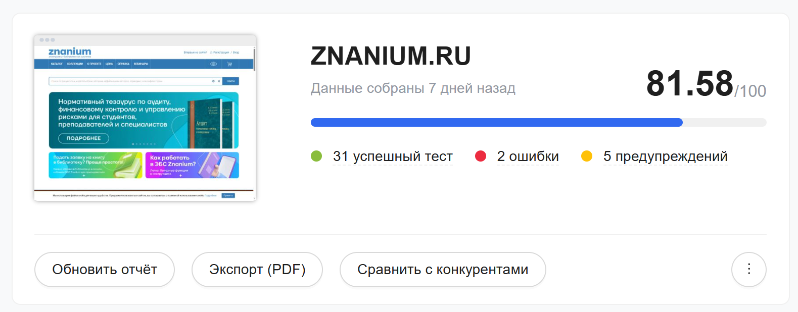
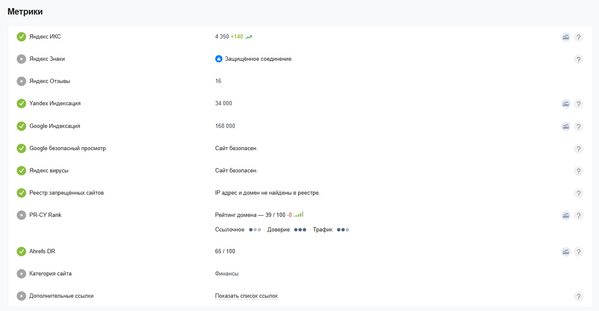
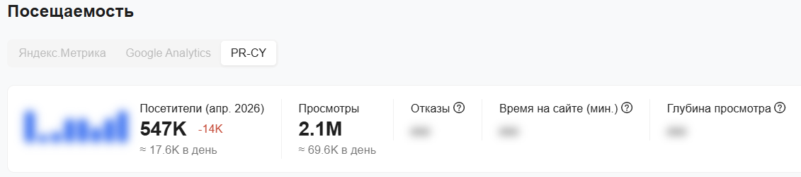
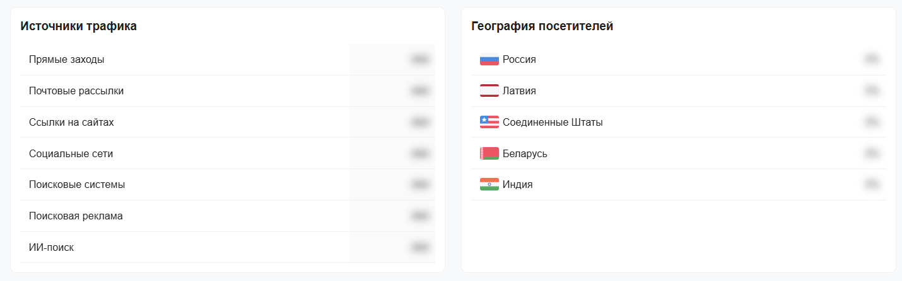
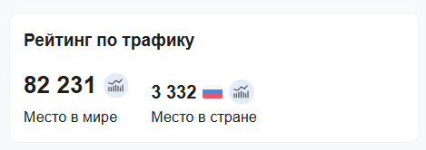

<h1 style="text-align:center">ЛАБОРАТОРНАЯ РАБОТА №1   «ПРОВЕДЕНИЕ ОБЩЕГО АУДИТА САЙТА: SEO, ЮЗАБИЛИТИ, ТЕКСТЫ»</h1>

<strong>Цель:</strong> научиться производить комплексный аудит заданного веб-ресурса.

## Этап 1 - Общий аудит

1. Используя ресурс http://pr-cy.ru/, проанализируем веб-сайт https://znanium.com/;

2. В процессе аудита проанализируем сильные и слабые стороны заданного веб-сайта.

## Этап 2 - SEO-оптимизация

Рисунок 1. Анализ сайта

Сайт проверяется по 80+ тестам, сервис определяет количество индексируемых страниц, строит динамику трафика, находит внешние и внутренние ссылки на сайт, анализирует оптимизацию текста, юзабилити и мобилопригодность страницы, считает видимость по поисковым фразам и другое.

Рисунок 2. Метрики сайта

Описание метрик:

1. Яндекс ИКС. Индекс качества сайта — это показатель того, насколько полезен ваш сайт для пользователей с точки зрения Яндекса. При расчете индекса качества учитываются размер аудитории сайта, поведенческие факторы и данные сервисов Яндекса. Значение индекса регулярно обновляется. Если у сайта есть зеркало, то показатель неглавного зеркала сайта будет равен показателю главного. Показатель ИКС поддомена сайта, как правило, равен показателю основного домена;

2. Яндекс Знаки. Рядом с адресом сайта в результатах поиска Яндекса могут появляться знаки, основанные на данных о поведении пользователей. Такие знаки могут свидетельствовать об удовлетворенности пользователей и их доверии к сайту;

3. Яндекс Отзывы - народный рейтинг и платформа Яндекса, где пользователи оставляют оценки, пишут впечатления и загружают фотографии о различных организациях, товарах, сайтах или услугах;

4. Яндекс Индексация. Примерное количество проиндексированных страниц в выдаче Яндекса можно посмотреть через оператор site:, что мы и делаем. Он покажет результат поиска по URL сайта, но точную цифру страниц в индексе выдавать не обязан;

5. Google Индексация. Сколько страниц сайта Google точно проиндексировал, узнать невозможно. Поисковик не ведет базу данных по URL-адресам. Примерное количество страниц в выдаче покажет оператор site:, на который мы ориентируемся. Число может быть искажено страницами, которые запрещены к индексу в robots.txt, но попали в выдачу из-за внешних ссылок на них. Чуть более точное количество покажет раздел «Статус индексирования» в Google Search Console, но и эти данные могут быть искажены из-за применения фильтров;

Рисунок 3. Посещаемость сайта

Рисунок 4. Источники трафика и география посетителей

Рисунок 5. Рейтинг сайта

## Этап 3 - Юзабилити-аудит

### Бизнес-цели сайта:

1. Обеспечение учебного и научного процесса

2. Поддержка образовательных учреждений

3. Монетизация контента

4. Продвижение издательской продукции

5. Развитие цифровой образовательной экосистемы

#### Список ожидаемых целевых действий клиентов:

1. Для учебного заведения: заключение договора на подписку ЭБС (Электронная библиотечная система)

2. Для индивидуального пользователя: оформление платной подписки

3. Для студента/преподавателя: успешный поиск и использование необходимых материалов

4. Для исследователя: использование сервисов анализа текстов

#### Кейс деления ЦА:

1. Студенты: основные пользователи, нуждающиеся в учебных материалах и пособиях для написания курсовых и дипломных работ

2. Преподаватели и научные сотрудники: пользователи, которым необходим доступ к материалам и пособиям, а также инструменты для формирования списков литературы и анализа публикаций

3. Аспиранты и исследователи: пользователи, заинтересованные в глубоком научном поиске, анализе текстов и подготовке диссертаций

4. Представители учебных заведений (библиотекари, администраторы): лица, принимающие решения о подписке и управляющие доступом для своих организаций

5. Специалисты различных отраслей: профессионалы, которым нужна актуальная информация для повышения квалификации или решения рабочих задач

### Описание кластеров целевой аудитории, целей и потребностей

#### Персонаж 1: студент-исследователь

- Имя: Евгений

- Роль: студент 4 курса

- Цели: найти актуальные материалы и учебные пособия по своей специальности для подготовки дипломной работы

- Потребности: быстрый и точный поиск, возможность читать онлайн, использовать фрагменты текста для цитирования, создавать закладки

- Вопросы: "Где найти книгу по моей теме?", "Можно ли использовать данный материал для дипломной работы?"

- Ожидания: интуитивно понятный интерфейс, высокая скорость загрузки страниц, удобная навигация по тексту

#### Персонаж 2: преподаватель-практик

- Имя: Анна Валерьевна

- Роль: доцент кафедры

- Цели: подобрать литературу для нового курса, проверить студенческие работы на заимствования, создать список рекомендованной литературы

- Потребности: расширенный поиск по метаданным, доступ к редким изданиям, инструменты для работы с группами студентов

- Вопросы: "Как сформировать список литературы?", "Как проверить работу на предмет плагиата?"

- Ожидания: наличие спецсервисов для преподавателей, надежность и полнота контента

#### Персонаж 3: администратор библиотеки

- Имя: Максим

- Роль: заведующий отделом комплектования библиотеки университета

- Цели: Оценить полноту коллекции для подписки, обеспечить доступ для всех студентов и сотрудников, получить статистику использования

- Потребности: детальная информация о составе коллекций, интеграция с системами вуза, понятная ценовая политика

- Вопросы: "Сколько изданий в этой коллекции?", "Как настроить удаленный доступ для всех?"

- Ожидания: прозрачность условий подписки, наличие демо-доступа, оперативная техподдержка

## Сценарии для юзабилити-аудита

### Сценарий 1 для персонажа "Студент-исследователь" (Евгений)

- Задача: найти учебник по численным методам и сохранить его в "Избранное"

- Сценарий: подготовка к экзамену. Необходим современный учебник по численным методам. Для этого нужно зайти на сайт znanium.com, найти подходящий учебник и добавить его в свой список избранного, чтобы вернуться к нему позже.

- Метрики для оценки: время выполнения задачи, количество кликов, количество ошибок, использование поиска

### Сценарий 2 для персонажа "Преподаватель-практик" (Анна Валерьевна)

- Задача: создать список литературы из 5 источников для нового курса и поделиться им со студентами

- Сценарий: разработка нового курса. Необходимо подобрать 5 учебных пособий. Используя расширенный поиск, находим подходящие издания и формируем из них список рекомендованной литературы. Затем находим способ поделиться этим списком со студентами.

- Метрики для оценки: успешность выполнения задачи (был ли создан список), время, затраченное на поиск и формирование; понятность интерфейса для работы со списками

### Сценарий 3 для персонажа "Администратор библиотеки" (Максим)

- Задача: найти информацию о коллекции "Программирование" и запросить тестовый доступ

- Сценарий: университет рассматривает возможность подписки на ЭБС Znanium. Необходимо оценить коллекцию "Программирование". Для этого необходимо найти страницу с описанием этой коллекции, узнайте количество входящих в нее изданий и оставить заявку на получение тестового доступа для университета

- Метрики для оценки: время поиска информации, понятность описания коллекции, легкость нахождения формы заявки

## Ответы на контрольные вопросы

1. Поисковый маркетинг - это комплекс методов продвижения сайта и бизнеса через поисковые системы и связанные с ними поисковые площадки

2. Принципы поиска информации:

- Четкая формулировка запроса

- Подбор ключевых слов

- Оценка релевантности источников

- Проверка достоверности

3. Цель комплексного аудита сайта — получить целостную и объективную оценку состояния сайта, выявить его сильные и слабые стороны, найти технические, SEO, контентные, UX и конверсионные проблемы, оценить потенциал роста и сформировать приоритетный план улучшений для достижения бизнес-целей.

4. Параметры комплексного аудита сайта:

- Технические параметры

- SEO-параметры

- Юзабилити и UX

- Безопасность

- Маркетинг и конкуренты