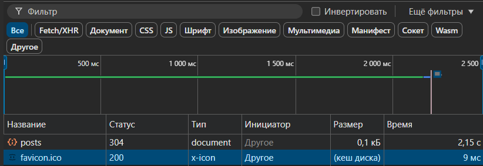
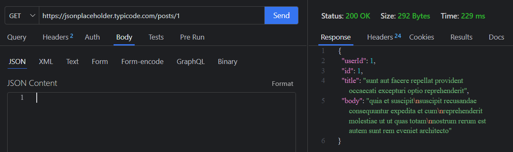
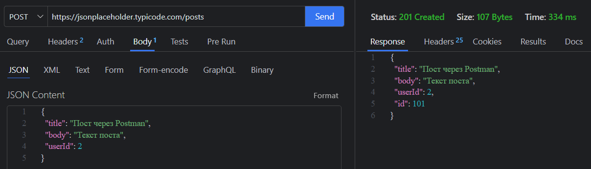
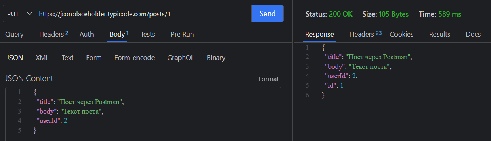
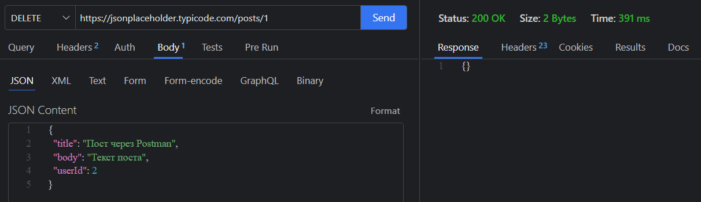

# ПР1

## Основные понятия

<strong>RFC</strong>. Документы, содержащие технические спецификации и стандарты, широко применяемые во всемирной сети интернет. Существует более 5000 документов

Формат заголовков соответствует общему формату заголовков текстовых сетевых сообщений ARPA (RFC 822)

#### Каждое HTTP-сообщение состоит из трех частей, которые передаются в указанном порядке:

1. Стартовая строка - определяет тип сообщения

2. Заголовки - характеризуют тело сообщения, параметры передачи и прочие сведения

3. Тело сообщения - непосредственно данные сообщения. Обязательно должно отделяться от заголовка пустой строкой. 

#### Стартовая структура запроса:

1. Метод - названия запроса, одно слово заглавными буквами

2. URI определяет путь к запрашиваемому документу

3. Версия  - пара разделенных точек цифр.

#### Структура ответа на запрос:

1. Версия

2. Код состояния - 3 цифры. По коду состояния определяется дальнейшее содержимое сообщения и поведения клиента

3. Пояснение - текстовое короткое пояснение к коду ответа для пользователя. Никак не влияет на сообщение и является необязательным

#### Коды состояния:

1. 1хх - информационный

2. 2хх - успех

3. 3хх - перенаправление

4. 4хх - ошибки клиента

5. 5хх - ошибки сервера

## Задание

Откроем страницу https://jsonplaceholder.typicode.com/posts, заходим во вкладку "Сеть" и фиксируем запросы.

Таблица 1. Запросы
<table>
    <tr>
        <th>Название запроса</th>
        <th>Метод</th>
        <th>URL</th>
        <th>Код ответа</th>
        <th>Размер данных</th>
        <th>Время загрузки</th>
    </tr>
    <tr>
        <td>posts</td>
        <td>GET</td>
        <td>https://jsonplaceholder.typicode.com/posts</td>
        <td>304</td>
        <td>0,1 кБ</td>
        <td>2,15 с</td>
    </tr>
    <tr>
        <td>1</td>
        <td>GET</td>
        <td>https://jsonplaceholder.typicode.com/posts/1</td>
        <td>200</td>
        <td>1,0 кБ</td>
        <td>752 мс</td>
    </tr>
    <tr>
        <td>posts?userId=1</td>
        <td>GET</td>
        <td>https://jsonplaceholder.typicode.com/posts?userId=1</td>
        <td>304</td>
        <td>0,1 кБ</td>
        <td>156 мс</td>
    </tr>
</table>


Рисунок 1. Список запросов

Выполним следующий код в консоли:

```
fetch("https://jsonplaceholder.typicode.com/posts/1")
  .then(res => res.json())
  .then(data => console.log(data));
```

Данные о запросе отражены в таблице 1.

### Выводы о запросе. 

Запрос, выполненный в коде, имеет меньшую нагрузку, чем первый, потому что он просит только первый пост, тогда как первый запрос запрашивает все посты, соответственно время ответа меньше.

## Следующий шаг. 
Заходим по ссылке https://jsonplaceholder.typicode.com/posts?userId=1 и смотрим ответ на соответствующий запрос, представленный в таблице 1.

### Выводы о запросе. 

Вернулось 10 объектов, в которых userId=1, размер ответа 0,8 кБ, время - 156 мс. Здесь параметр userId=1 уменьшает объем данных, ибо требуется вернуть только те объекты, в которых идентификатор пользователя равен 1.

## Следующий шаг, мы выполняем следующий код в консоли:

`
fetch("https://jsonplaceholder.typicode.com/posts/1") .then(res => res.json()) .then(data => console.log(data));
fetch("https://jsonplaceholder.typicode.com/posts/2") .then(res => res.json()) .then(data => console.log(data));
fetch("https://jsonplaceholder.typicode.com/posts/3") .then(res => res.json()) .then(data => console.log(data));
`

Результаты отображены в таблице 2.

Таблица 2. 3 запроса одновременно

<table>
    <tr>
        <th>Название запроса</th>
        <th>Метод</th>
        <th>URL</th>
        <th>Код ответа</th>
        <th>Размер данных</th>
        <th>Время загрузки</th>
    </tr>
    <tr>
        <td>posts</td>
        <td>GET</td>
        <td>https://jsonplaceholder.typicode.com/posts</td>
        <td>304</td>
        <td>0,5 кБ</td>
        <td>147 мс</td>
    </tr>
    <tr>
        <td>1</td>
        <td>GET</td>
        <td>https://jsonplaceholder.typicode.com/posts/1</td>
        <td>304</td>
        <td>0,3 кБ</td>
        <td>271 мс</td>
    </tr>
    <tr>
        <td>2</td>
        <td>GET</td>
        <td>https://jsonplaceholder.typicode.com/posts/1</td>
        <td>304</td>
        <td>0,1 кБ</td>
        <td>271 мс</td>
    </tr>
    <tr>
        <td>3</td>
        <td>GET</td>
        <td>https://jsonplaceholder.typicode.com/posts/1</td>
        <td>304</td>
        <td>0,4 кБ</td>
        <td>271 мс</td>
    </tr>
</table>

### Выводы о запросе

Обратим внимание, что после того, как запрос сделан, отклик чуть дольше, чем обычно - 3 запроса одновременно отправляются на сервер. Также обратим внимание на то, что время в таблице 2 у трех запросов одинаково - 271 мс. Это означает, что запросы идут параллельно.

## Заголовки и ответы

Выпишем из запроса posts заголовки Access-control-allow-credentials, Cache-Control, ETag, Date, Server. Результаты представлены в таблице 3.

Таблица 3. Заголовки

<table>
    <tr>
        <th>Название запроса</th>
        <th>Access-control-allow-credentials</th>
        <th>Cache-control</th>
        <th>ETag</th>
        <th>Date</th>
        <th>Server</th>
    </tr>
    <tr>
        <td>posts</td>
        <td>true</td>
        <td>max-age=43200</td>
        <td>W/"6b80-Ybsq/K6GwwqrYkAsFxqDXGC7DoM"</td>
        <td>Wed, 09 Sep 2026 11:40:27 GMT</td>
        <td>cloudflare</td>
    </tr>
</table>

Preview - это обработанный браузером ответ. Response - это сырой (raw) текст ответа, каким он пришел по сети.

## Оптимизация запросов

Сравним ответы /posts, /posts?userId=1 и /posts/1 в таблице 4.

Таблица 4. Заголовки запросов

<table>
    <tr>
        <th>Запрос</th>
        <th>Размер ответа</th>
        <th>Время загрузки</th>
    </tr>
    <tr>
        <td>posts</td>
        <td>0,8 кБ</td>
        <td>946 мс</td>
    </tr>
    <tr>
        <td>posts?userId=1</td>
        <td>0,4 кБ</td>
        <td>194 мс</td>
    </tr>
    <tr>
        <td>posts/1</td>
        <td>0,4 кБ</td>
        <td>222 мс</td>
    </tr>
</table>

Меры оптимизации запросов:

1. Пагинация (ограничение количества записей на страницу);

2. Фильтрация (по userId, статусам и т.п.);

3. Уменьшение размера ответа (убрать лишние поля);

4. Кэширование на клиенте и сервере;

5. Использование правильных заголовков (Cache-Control, ETag и т.д.).

## Работа с API через Postman

Здесь будет использоваться аналог Postman на VS Code - Thunder Client. Открываем расширение, выбираем метод GET и вставляем https://jsonplaceholder.typicode.com/posts. Получаем тот же ответ, что и posts в DevTools. 

Затем вставляем https://jsonplaceholder.typicode.com/posts/1 - выводится только пост с идентификатором 1. Результат показан на рисунке 2.



Рисунок 2. Результат запроса GET https://jsonplaceholder.typicode.com/posts/1

Далее - выполняем POST в https://jsonplaceholder.typicode.com/posts с телом:
```
{
  "title": "Пост через Postman",
  "body": "Текст поста",
  "userId": 2
}
```

На сервер отправляется запрос с данным телом и создается пост. Получаем следующий ответ, который изображен на рисунке 3.



Рисунок 3. Результат запроса POST в https://jsonplaceholder.typicode.com/posts

Далее в первом посте выполняем PUT, вставляя предыдущее тело. Ответ изображен на рисунке 4.



Рисунок 4. Запрос обновления первого поста через PUT

Далее в первом посте выполняем DELETE, получаем ответ, изображенный на рисунке 5.



Рисунок 5. Результат удаления первого поста

DevTools нужен для того, чтобы посмотреть, какие данные приходят на фронтенд или, к примеру, что конкретно тормозит страницу. А Postman нужен для того, чтобы тестировать написанное API, например, правильно ли сохраняется данные в POST-запросе, или же правильные ли данные приходят в GET-запросе.

## Контрольные вопросы

1. Это набор встроенных инструментов в браузерах для отладки веб-страниц. Позволяет разработчикам видеть, что происходит внутри браузера. "Элементы" показывает верстку страницы, "Консоль" - логи, "Сеть" - мониторинг запросов на сервер и ответы.

2. Правая кнопка мыши --> посмотреть код --> "Сеть". 

3. Стартовая структура запроса:

- Метод - названия запроса, одно слово заглавными буквами

- URI определяет путь к запрашиваемому документу

- Версия - пара разделенных точек цифр.

4. GET нужен для забора данных, POST - для отправки данных на сервер, PUT - для полного обновления, PATCH - для частичного обновления, DELETE - для удаления.

5. HEAD: Аналогичен GET, но возвращает только заголовки. Используется, чтобы проверить наличие файла, узнать его размер (Content-Length) или дату последнего изменения.

OPTIONS: Используется, чтобы узнать, какие HTTP-методы поддерживает сервер для конкретного URL (например, разрешен ли DELETE).

Preflight-запрос — это служебный запрос OPTIONS, который браузер автоматически отправляет перед "сложными" запросами (не GET/POST с простыми заголовками) при кросс-доменных вызовах (CORS). 

6. Коды ответов:

- 1хх - информационный

- 2хх - успех

- 3хх - перенаправление

- 4хх - ошибки клиента

- 5хх - ошибки сервера

7. REST (Representational State Transfer) — это архитектурный стиль построения API. Ключевое правило: взаимодействие строится вокруг ресурсов.

На уровне URL ресурс представляется следующим образом:

/products — коллекция товаров.

/products/42 — конкретный товар с идентификатором 42.

/users/5/orders — коллекция заказов конкретного пользователя.

8. Типы данных JSON: String, Number, Boolean, Null, Object, Array

Пример объекта:

```
{
  "id": 1,
  "name": "Alice",
  "isActive": true,
  "profile": null
}
```

Пример массива:

```
[10, 20, "text", false, { "key": "value" }]
```

9. Preview - это обработанный браузером ответ. Response - это сырой (raw) текст ответа, каким он пришел по сети.

10. Заголовки для оптимизации:

- Content-Type: указывает формат тела ответа/запроса

- Cache-Control: главный заголовок кэширования. Значения: public (можно кэшировать всем), private (только браузеру), max-age=3600 (живет час), no-cache (спрашивать сервер перед использованием), no-store (вообще не кэшировать).

- ETag: уникальный хеш версии ресурса

- Authorization: Передает токен доступа для аутентификации пользователя на сервере

- Accept-Encoding (в запросе) / Content-Encoding (в ответе): Отвечают за сжатие

11. Приемы снижения нагрузки на сеть:

- Пагинация: Отдавать данные страницами (параметры ?page=2&size=20 или ?offset=100&limit=50).

- Фильтрация: позволять клиенту запрашивать только нужные данные.

- Сортировка: делать сортировку на бэкенде, а не на фронтенде.

- Кэширование (Caching): использовать заголовки Cache-Control и ETag на сервере.

- Сжатие (Compression): Включить на сервере сжатие Gzip/Brotli.

12. DevTools нужен для того, чтобы посмотреть, какие данные приходят на фронтенд или, к примеру, что конкретно тормозит страницу. А Postman нужен для того, чтобы тестировать написанное API, например, правильно ли сохраняется данные в POST-запросе, или же правильные ли данные приходят в GET-запросе.